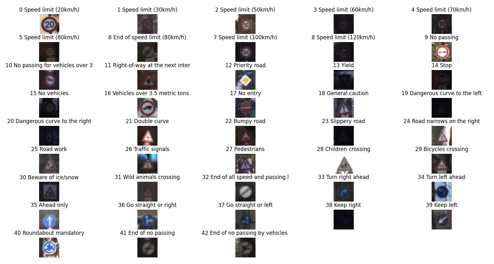
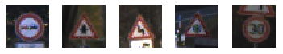
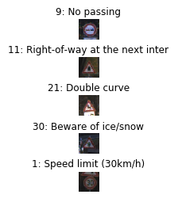
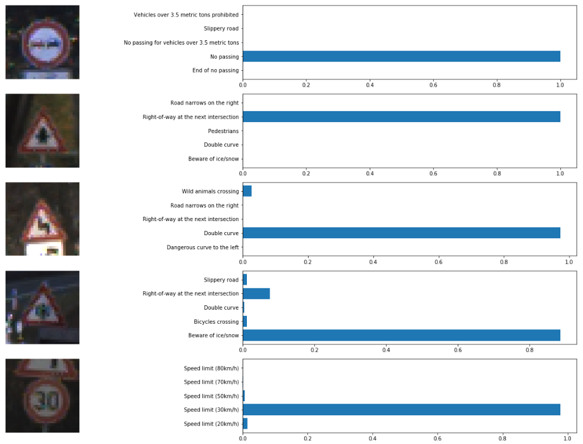

# **Traffic Sign Recognition** 

**Build a Traffic Sign Recognition Project**

The goals / steps of this project are the following:
* Load the data set (see below for links to the project data set)
* Explore, summarize and visualize the data set
* Design, train and test a model architecture
* Use the model to make predictions on new images
* Analyze the softmax probabilities of the new images
* Summarize the results with a written report

## Rubric Points

This repository includes the required files to meet the specifications:
* [Ipython notebook with code](./Traffic_Sign_Classifier.ipynb)
* [HTML output of the code](./Traffic_Sign_Classifier.html)

---
### Data Set Summary & Exploration

#### 1. Provide a basic summary of the data set. In the code, the analysis should be done using python, numpy and/or pandas methods rather than hardcoding results manually.

I used the pandas library to calculate summary statistics of the traffic
signs data set:

```python
import numpy as np

n_train = y_train.shape[0]
n_validation = y_valid.shape[0]
n_test = y_test.shape[0]
image_shape = X_train.shape[1:3]
n_classes = np.unique(np.concatenate((y_train, y_valid, y_test))).size
```

* The size of training set is 34799
* The size of the validation set is 4410
* The size of test set is 12630
* The shape of a traffic sign image is 32x32
* The number of unique classes/labels in the data set is 43

#### 2. Include an exploratory visualization of the dataset.

To visualize the traffic sign dataset that we'll be working with during the project, all of them have been plotted next to their identifier so that they can be properly preclassified which will be useful when validating predictions at the end of the process.



### Design and Test a Model Architecture

#### 1. Describe how you preprocessed the image data. What techniques were chosen and why did you choose these techniques? Consider including images showing the output of each preprocessing technique. Pre-processing refers to techniques such as converting to grayscale, normalization, etc. (OPTIONAL: As described in the "Stand Out Suggestions" part of the rubric, if you generated additional data for training, describe why you decided to generate additional data, how you generated the data, and provide example images of the additional data. Then describe the characteristics of the augmented training set like number of images in the set, number of images for each class, etc.)

As a first step, I decided to convert the images to grayscale because it simplifies the process of recognition, since having an RGB image adds features that are not relevant to the detection process. By applying this grayscale conversion the images get reshaped, which we have to take into account when using the model.

I then normalized the image data to obtain a mean zero and equal variance, for which I followed the expression given in the project notes: `(pixel - 128)/ 128`

The code snippet for these preprocessing operations can be seen below:

```python
def pre_process():
    """
    Preprocess the data here. It is required to normalize the data. Other preprocessing steps could include
    converting to grayscale, etc.
    Feel free to use as many code cells as needed.
    """
    # Convert to grayscale
    X_train_g = np.sum(X_train / 3, axis=3, keepdims=True)
    X_valid_g = np.sum(X_valid / 3, axis=3, keepdims=True)
    X_test_g = np.sum(X_test / 3, axis=3, keepdims=True)
    
    X_train_norm = (X_train_g - 128) / 128
    X_valid_norm = (X_valid_g - 128) / 128
    X_test_norm = (X_test_g - 128) / 128

    return {"X_train": X_train_norm,
            "X_valid": X_valid_norm,
            "X_test": X_test_norm}
```


#### 2. Describe what your final model architecture looks like including model type, layers, layer sizes, connectivity, etc.) Consider including a diagram and/or table describing the final model.

I built my model on top of the LeNet-5 implementation shown in the classroom during the Convolutional Neural Networks lesson, for which I started by adapting the code to the specifications of the current dataset. The German Traffic Sign Dataset contains 43 sign images, as we identified previously, so the number of classes of the LeNet-5 implementation needs to be updated.

My final model consisted of the following layers:

| Layer         		|     Description	        					| 
|:---------------------:|:---------------------------------------------:| 
| Input         		| 32x32x1 Grayscale image   					| 
| Convolution 5x5     	| 1x1 stride, 'VALID' padding, outputs 28x28x6 	|
| RELU 1				|												|
| Max pooling	      	| 2x2 stride,  outputs 14x14x6 				    |
| Convolution 5x5     	| 1x1 stride, 'VALID' padding, outputs 10x10x16	|
| RELU 2				|												|
| Max pooling	      	| 2x2 stride,  outputs 10x10x6 				    |
| Convolution 5x5     	| 1x1 stride, 'VALID' padding, outputs 5x5x16 	|
| Flatten				| Input 5x5x16, outputs 400						|
| Fully connected		| Input 400, outputs 120        				|
| Fully connected		| Input 120, outputs 84        					|
| Fully connected		| Input 84, outputs 43        					|
|						|												|
|						|												|
 
The code cell where the model is described contains the definition of the LeNet method, as follows:

```python
def LeNet(x):
    conv1_W = tf.Variable(tf.truncated_normal(shape=(5, 5, DIMS, 6),
                                              mean=mu,
                                              stddev=sigma))
    conv1_b = tf.Variable(tf.zeros(6))
    conv1 = tf.nn.conv2d(x,
                         conv1_W,
                         strides=[1, 1, 1, 1],
                         padding='VALID') + conv1_b
    conv1 = tf.nn.relu(conv1)
    conv1 = tf.nn.max_pool(conv1,
                           ksize=[1, 2, 2, 1],
                           strides=[1, 2, 2, 1],
                           padding='VALID')

    conv2_W = tf.Variable(tf.truncated_normal(shape=(5, 5, 6, 16),
                                              mean=mu,
                                              stddev=sigma))
    conv2_b = tf.Variable(tf.zeros(16))
    conv2 = tf.nn.conv2d(conv1,
                         conv2_W,
                         strides=[1, 1, 1, 1],
                         padding='VALID') + conv2_b
    conv2 = tf.nn.relu(conv2)
    conv2 = tf.nn.max_pool(conv2,
                           ksize=[1, 2, 2, 1],
                           strides=[1, 2, 2, 1],
                           padding='VALID')

    fc0 = flatten(conv2)
    fc0 = tf.nn.dropout(fc0, keep_prob)

    fc1_W = tf.Variable(tf.truncated_normal(shape=(400, 120),
                                            mean=mu,
                                            stddev=sigma))
    fc1_b = tf.Variable(tf.zeros(120))
    fc1 = tf.matmul(fc0, fc1_W) + fc1_b
    fc1 = tf.nn.relu(fc1)
    fc1 = tf.nn.dropout(fc1, keep_prob)
    
    fc2_W = tf.Variable(tf.truncated_normal(shape=(120, 84),
                                            mean=mu,
                                            stddev=sigma))
    fc2_b = tf.Variable(tf.zeros(84))
    fc2 = tf.matmul(fc1, fc2_W) + fc2_b
    fc2 = tf.nn.relu(fc2)
    fc2 = tf.nn.dropout(fc2, keep_prob)

    fc3_W = tf.Variable(tf.truncated_normal(shape=(84, num_class),
                                            mean=mu,
                                            stddev=sigma))
    fc3_b = tf.Variable(tf.zeros(num_class))
    logits = tf.matmul(fc2, fc3_W) + fc3_b

    return logits
```


#### 3. Describe how you trained your model. The discussion can include the type of optimizer, the batch size, number of epochs and any hyperparameters such as learning rate.

The model was trained using an Adam Optimizer, for which I used the tensor flow command `tf.train.AdamOptimizer` that provides an extremely simplified way of implementing this type of optimizer, which is an "extension" of the regular stochastic gradient descent.

For it to be successful when trying to comply the need of a validation accuracy of 0.93, I had to spend quite some time tweaking the parameters and reviewing the effect that each one of them had on the obtained results.

I ended up with a best result of **0.95 test accuracy** when using the following configuration. 

| Parameter	        | Value     | 
|:-----------------:|:---------:| 
| Epochs         	| 150   	| 
| Batch size     	| 128       |
| Learning rate		| 0.06		|
| Mu	      	    | 0         |
| Sigma	      	    | 0.1 	    |

```
Model saved
INFO:tensorflow:Restoring parameters from ./lenet
Test Accuracy = 0.950
```

It is relevant to note that the results improved considerably in terms of accuracy when performing the operation with pre-processed images that were previously converted to grayscale.

In order to get to a point where the accuracy reached the desired level, I had to follow a considerable number of iterations, since I had no previous experience with this type of algorithms (or any neural network, to be precise). I would say that 75% of the time I required to finish the project was spent on this particular step of the process. While re-adjusting the original values found in the LeNet example given in the lessons, I got to interact with the code a little further and improve my understanding on how it operates and how the values used for the hyperparameters are crucial to get a successful result.
 

### Test a Model on New Images

#### 1. Choose five German traffic signs found on the web and provide them in the report. For each image, discuss what quality or qualities might be difficult to classify.

These are the German traffic sign images I found on the web that will be used to test the classification accuracy of the proposed model.



From all the selected images, it looks like the `30: Beware of ice/snow` may be the most difficult to classify, since the quality of the picture is not as good as desired and the features that can be identified in order to create a proper classification may not be easily recognizable.

#### 2. Discuss the model's predictions on these new traffic signs and compare the results to predicting on the test set. At a minimum, discuss what the predictions were, the accuracy on these new predictions, and compare the accuracy to the accuracy on the test set (OPTIONAL: Discuss the results in more detail as described in the "Stand Out Suggestions" part of the rubric).

The identifiers of the traffic signs from the csv file will be used to easily verify the accuracy of the classification. The expected results (the IDs of the test images) will be stored in an array for validation. 

The following image shows the results of the predictions. In this case, I plot the test image that's been analyzed and add, as a title, the ID of the result obtained after the classification:



| Image			        |     Prediction	     | 
|:---------------------:|:----------------------:| 
| 9: No passing      	| 9: No passing   		 | 
| 11: Right-of-way    	| 11: Right-of-way 		 |
| 21: Double curve		| 21: Double curve		 |
| 30: Beware ice/snow	| 30: Beware ice/snow	 |
| 1: Speed limit (30)	| 1: Speed limit (30)    |


The model was able to correctly guess 5 of the 5 traffic signs, which gives an accuracy of 100%. This compares favorably to the accuracy on the test set of 95%.

#### 3. Describe how certain the model is when predicting on each of the five new images by looking at the softmax probabilities for each prediction. Provide the top 5 softmax probabilities for each image along with the sign type of each probability. (OPTIONAL: as described in the "Stand Out Suggestions" part of the rubric, visualizations can also be provided such as bar charts)

For this last step, I spent quite some time reviewing the possible representations that could depict the results in a way that clearly identifies the meaning of what's obtained. After searching through the web, I found that using a histogram that shows the different probabilities for each classification on a single image is a very visual and useful solution.



As expected, the `Beware of ice/snow` sign is the one that's less unequivocally identified, but we still get a very high level of accuracy in the classification.

